# fb-arcade

Retro-style arcade games that play themselves, drawn straight to the Linux framebuffer.
No window system, no GPU, no dependencies on the device: just Python 3 and `/dev/fb0`.
Plug a small board into a TV and it becomes an arcade screensaver.

Nineteen games rotate with a transition between them. A bot plays each one until it reaches a score
target (or about nine minutes at most), shows the result and moves on.

| Game | Inspired by |
|------|-------------|
| `snake` | Snake with a new brick layout every game (bars, posts, corners, crosses, mirrored), a choice of red (grow), blue (shrink) and golden (bonus) apples, solved offline with a dynamic Hamiltonian cycle |
| `tetris` | Tetris, two-piece lookahead bot |
| `bomber` | Bomberman |
| `sonic` | Sonic the Hedgehog: short acts with loops, four characters (hedgehog, fox, echidna, dark hedgehog), scanline parallax |
| `fzero` | F-Zero, pseudo-3D hover racing |
| `moto` | Hang-On / Super Hang-On, pseudo-3D motorbike racing |
| `pacman` | Pac-Man, original maze and ghost targeting |
| `invaders` | Space Invaders, erodible shields |
| `frogger` | Frogger with a space theme |
| `battletoads` | Battletoads, canyon beat 'em up |
| `turbo` | Battletoads' Turbo Tunnel |
| `tanks` | Battle City |
| `isaac` | The Binding of Isaac, room-by-room roguelike shooter |
| `persia` | Prince of Persia, dungeon platformer with sword fights |
| `deadspace` | Dead Space, side-view survival horror with limb-by-limb dismemberment |
| `flappy` | Flappy Bird, with the original physics, medals and score card |
| `doodle` | Doodle Jump, notebook paper, every platform type, monsters and power-ups |
| `redball` | Red Ball, physics platformer with bosses across grass, factory, lava and ice worlds |
| `temple` | Temple Run, pseudo-3D endless runner with corners, monkeys and power-ups |

## Screenshots

| | | |
|:-:|:-:|:-:|
| 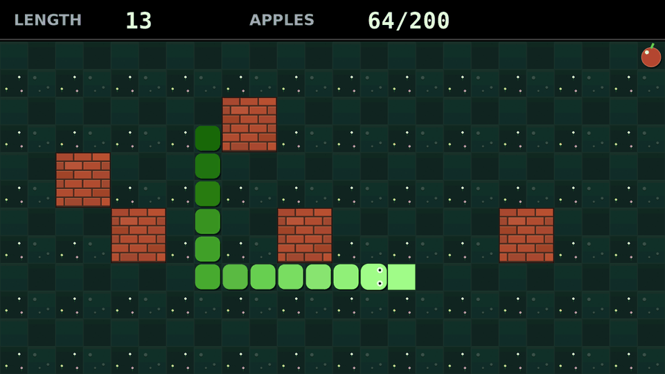 | 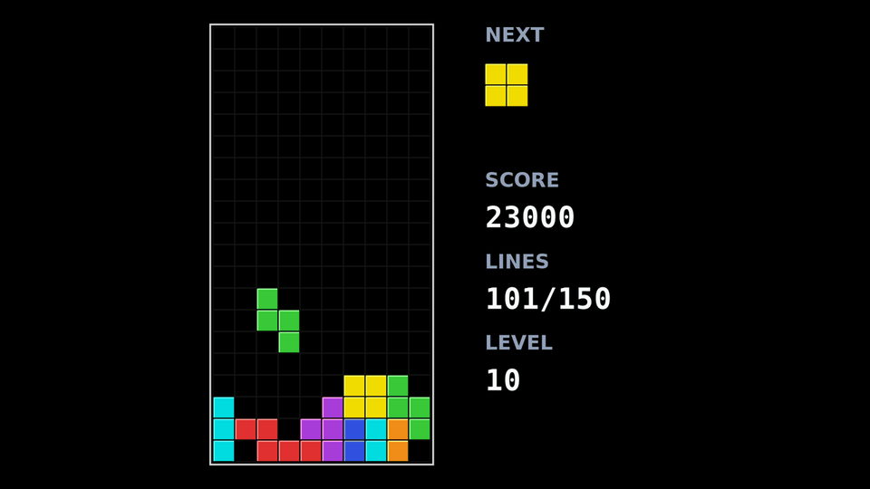 | 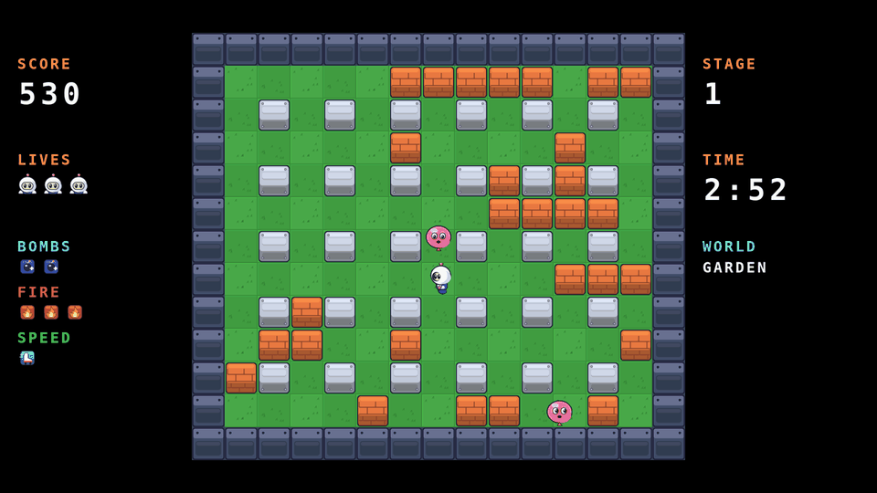 |
| `snake` | `tetris` | `bomber` |
| 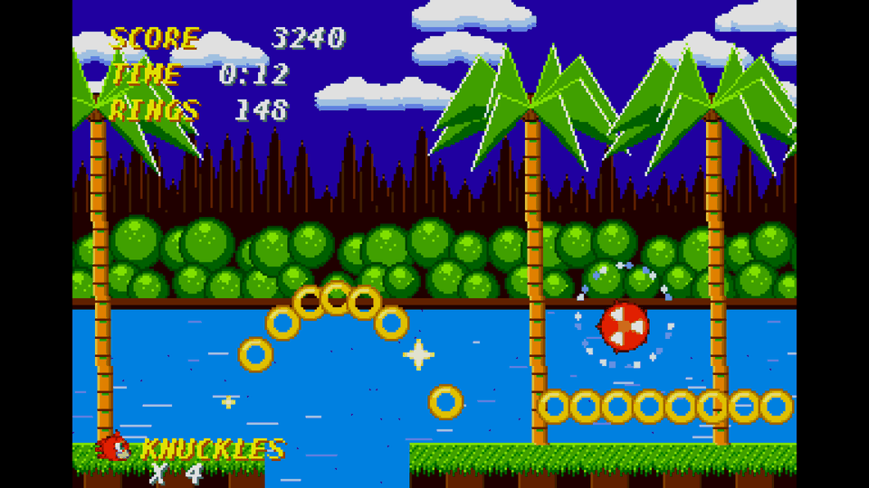 | 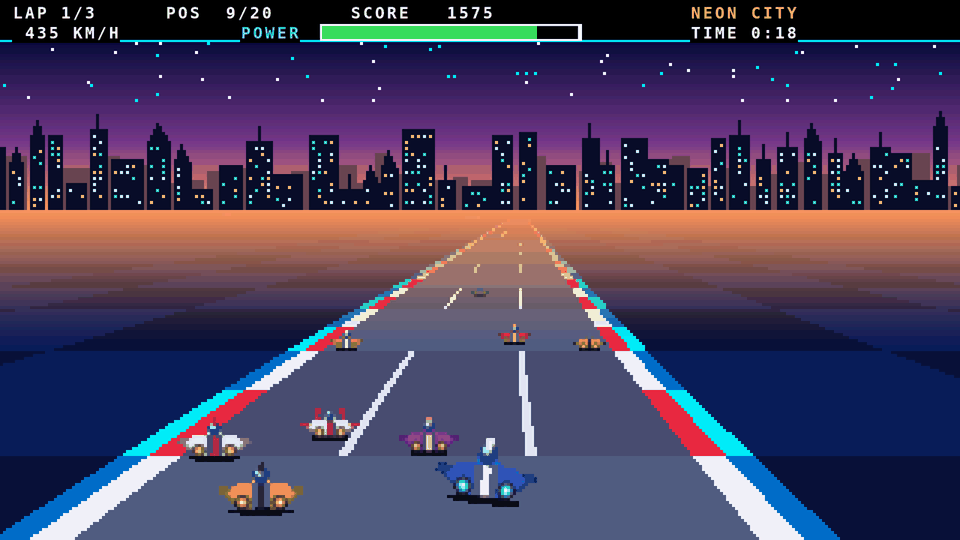 | 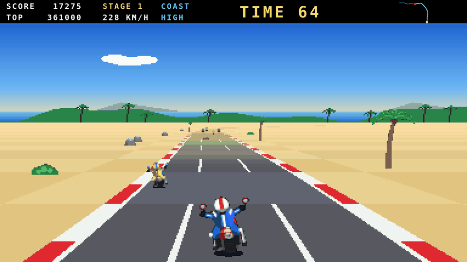 |
| `sonic` | `fzero` | `moto` |
| 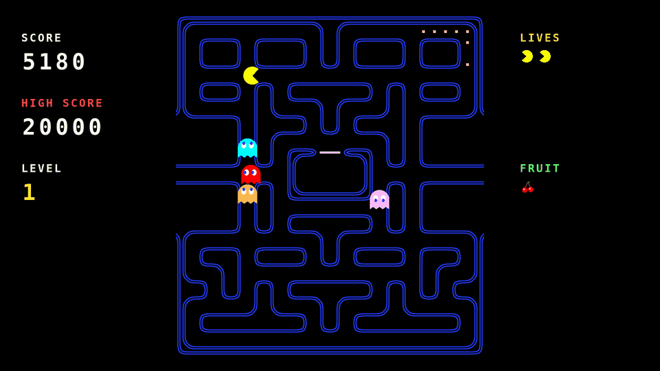 | 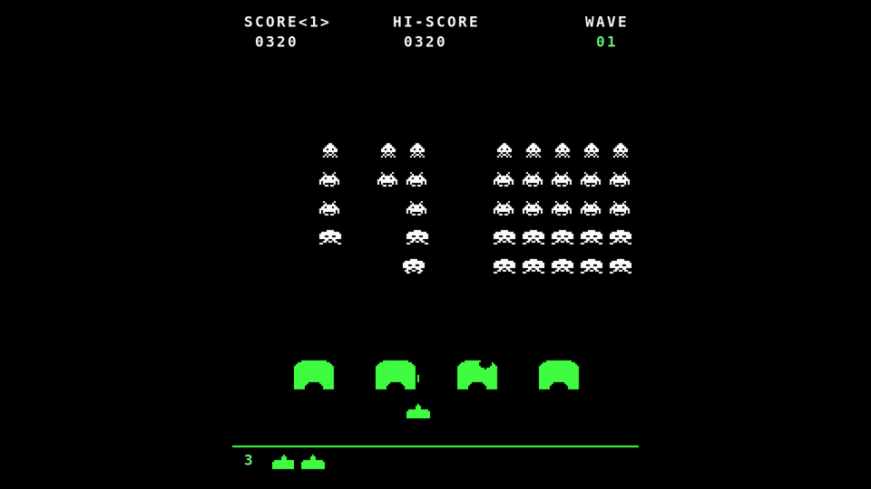 | 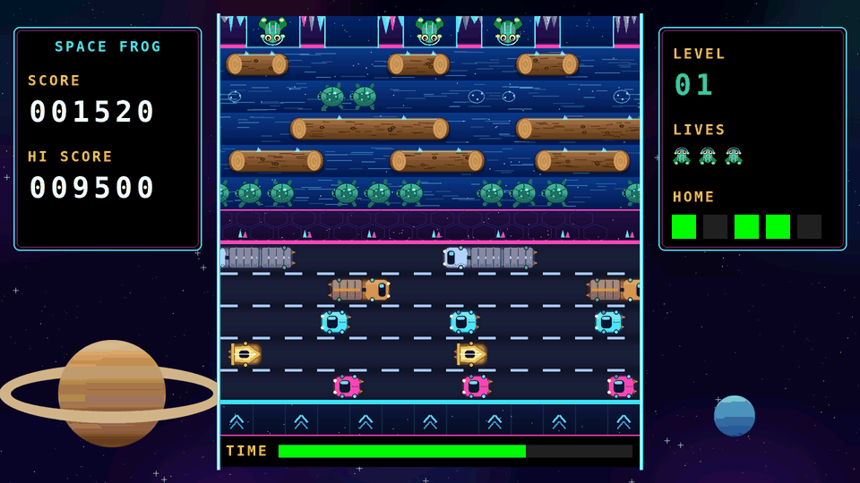 |
| `pacman` | `invaders` | `frogger` |
| 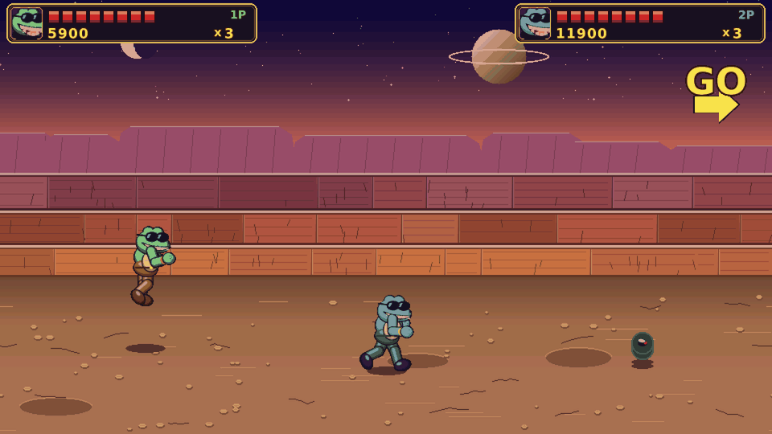 | 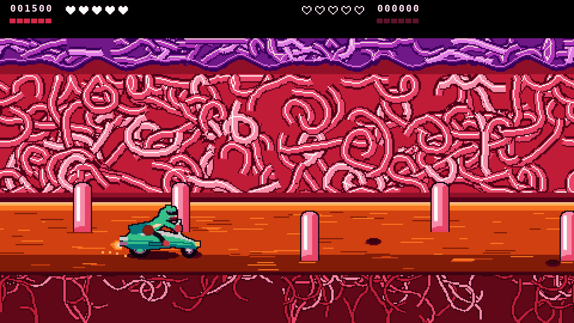 | 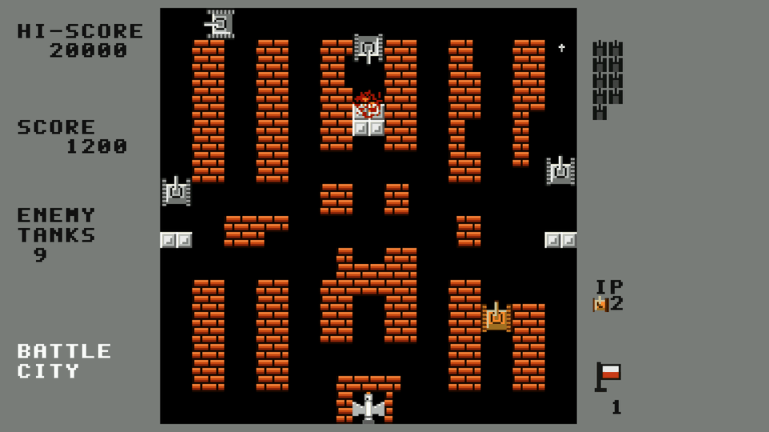 |
| `battletoads` | `turbo` | `tanks` |
| 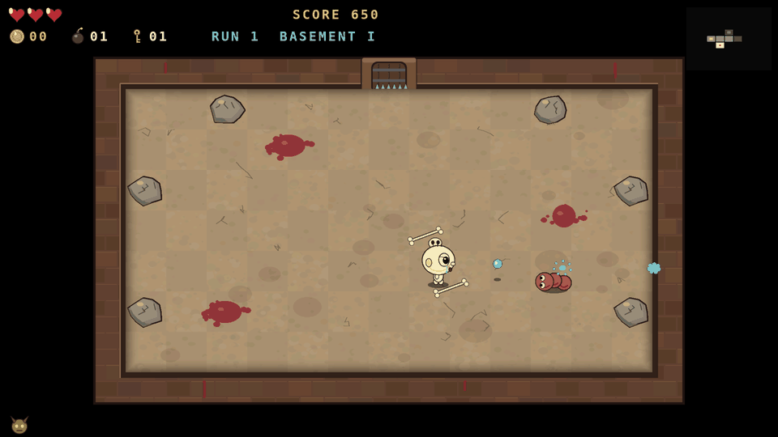 | 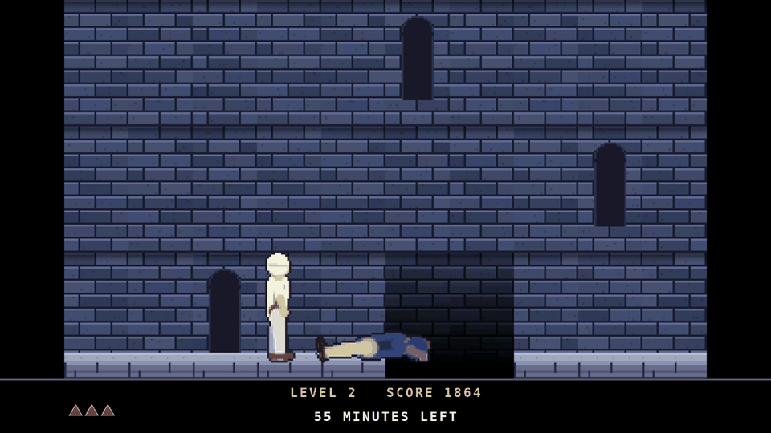 | 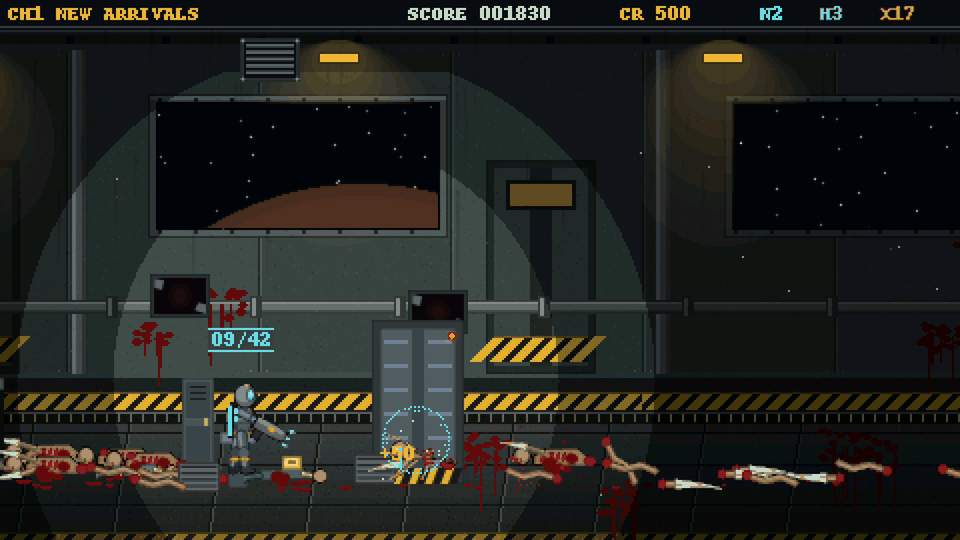 |
| `isaac` | `persia` | `deadspace` |
| 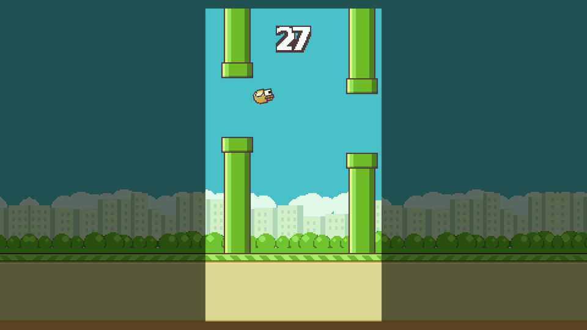 | 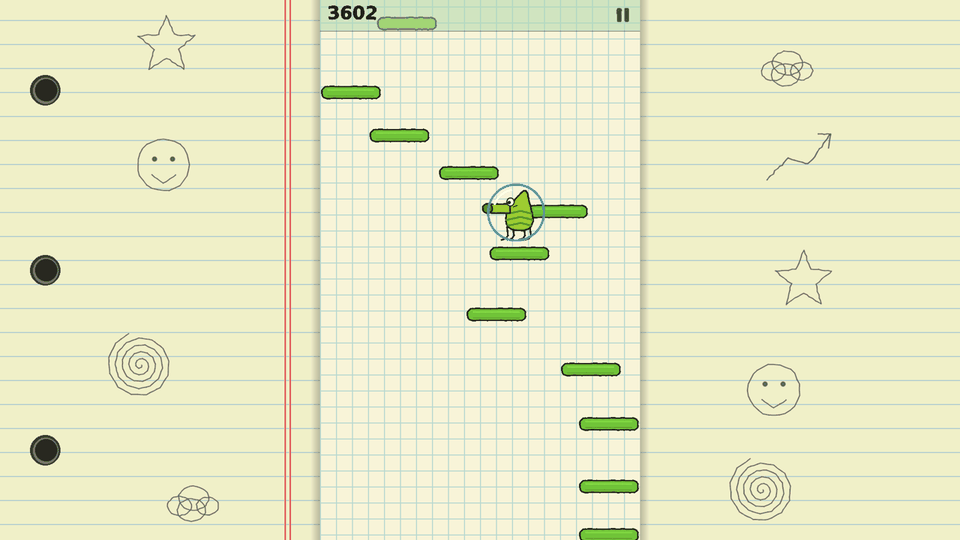 | 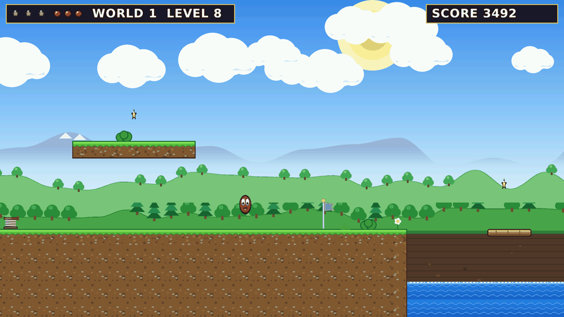 |
| `flappy` | `doodle` | `redball` |
| 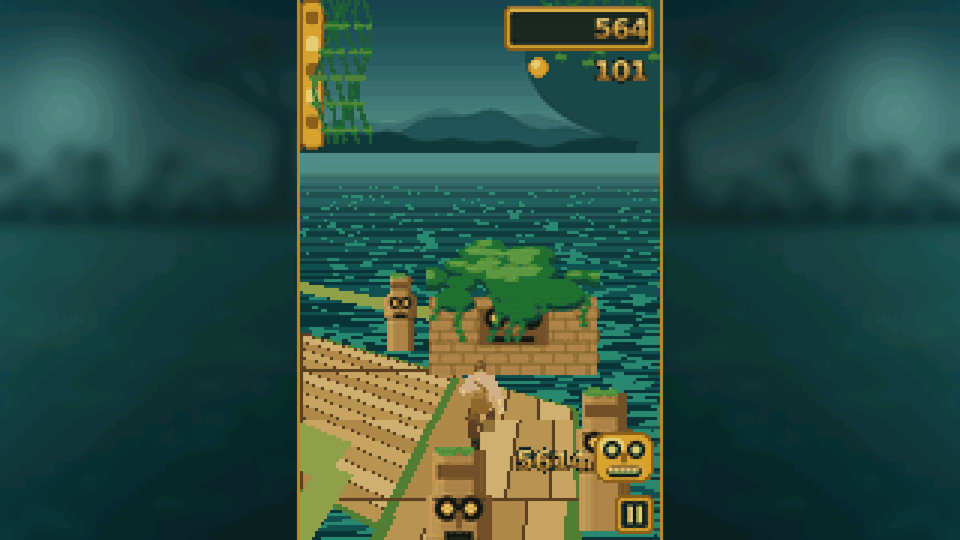 |  |  |
| `temple` |  |  |

## Requirements

- **Device:** Linux with a 1920x1080, 16 bit (RGB565) framebuffer at `/dev/fb0`
  (check with `cat /sys/class/graphics/fb0/{virtual_size,bits_per_pixel}`) and Python 3.
  Developed and tested on a Raspberry Pi 3B+ over HDMI. A faster board only helps.
- **Build machine:** Python 3, [Pillow](https://pypi.org/project/pillow/) and the DejaVu fonts.
  Sprites are drawn here once; the device never needs Pillow.

## Install

```sh
git clone https://github.com/SoulOriginal/fb-arcade.git
cd fb-arcade
pip install pillow
make build                # writes everything the device needs to dist/
```

Copy `dist/` to the device (any directory, for example `/opt/fb-arcade`) and run it on the console,
not inside a graphical session:

```sh
sudo systemctl stop getty@tty1     # the login prompt draws on the same framebuffer
sudo python3 /opt/fb-arcade/launcher.py
```

Play one game only: `GAME_ONLY=pacman python3 launcher.py`.
Start at boot: edit the path in `contrib/fb-arcade.service`, install it as a systemd unit and enable it.

## Development

```sh
python3 tools/run_one.py tanks 3000 600   # headless run, snapshot every 600 ticks (snap_tanks_*.png)
python3 arcade/bench.py pacman            # on the device: CPU time per tick, budget is 33 ms
```

A game is a module `arcade/g_<name>.py` with `make()` returning `step()`. `step()` runs 30 times per
second and returns `True` once the game is over. Sprites are built by `build/g_<name>_build.py` into
`g_<name>.bin` and loaded with `load_bundle`. Add the name to `ALL` in `arcade/launcher.py`.
`arcade/fbcore.py` has the drawing helpers (`blit`, `fill_rect`, `write_row`, `draw_text`).

## Notes

Colours are RGB565, so each pixel is two bytes; a full frame is 4 MB and writes in 5 to 8 ms on a Pi 3.
Scrolling games build each frame from scanline slices instead of drawing per pixel.

All graphics are drawn from scratch by the build scripts. No ROMs, sprites, sounds or code from the original
games are included. Game names only say what inspired each tribute; they belong to their respective owners
and this project is not affiliated with or endorsed by them.

## License

MIT, see [LICENSE](LICENSE).

### Optional sprite sheets

The repository only contains hand-drawn placeholder art. If you own sprite sheets you want to use for `sonic`, put them in `build/assets/` (ignored by git) before `make build`; see `build/g_sonic_sheets.py` for the expected file names.
